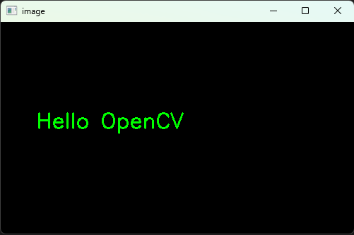
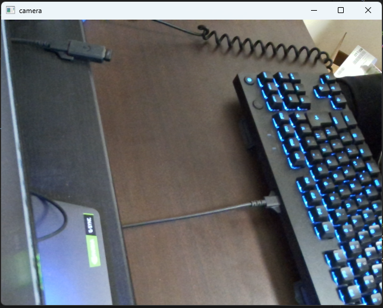
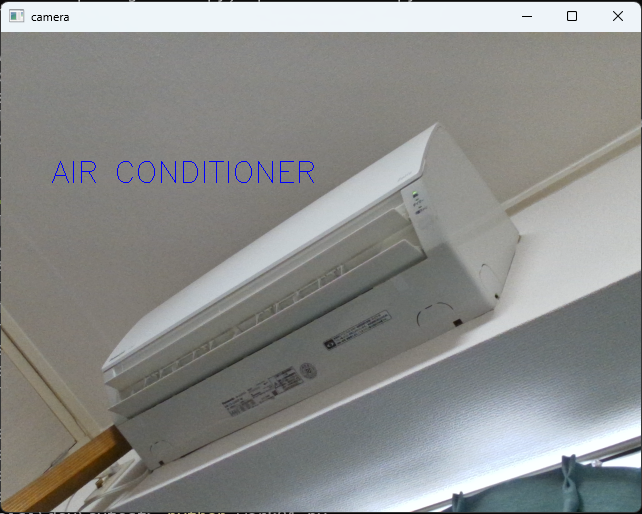

以下，難しくてわからないところ・うまく動かないところがあれば連絡ください．

# Pythonを使って画像処理をする(OpenCV)

OpenCV(画像処理ライブラリ)を使ってプログラミングしてみましょう．<br>

情報学科の学生は「プログラミングⅠ」でPythonの実行環境が用意できているはず...

## 事前準備

PythonでOpenCVのライブラリが扱えるようにしましょう．

以下のコマンドをターミナルで実行してみてください．
"> "は入力してはいけません．

授業で使ってたのはコマンドプロンプトかな？？

```batch
> pip install opencv-contrib-python
```

```batch
> pip install numpy
```
## 1. OpenCVで文字の描画

 `cvtest01.py` というファイルを作成して以下のコードを記述してください．

***

```python
import cv2
import numpy as np

# 黒い画像を作成（高さ300, 幅500）
img = np.zeros((300, 500, 3), dtype=np.uint8)

# 文字を描画
cv2.putText(
    img,
    "Hello OpenCV",
    (50, 150),
    cv2.FONT_HERSHEY_SIMPLEX,
    1,
    (0, 255, 0)
)

# 表示
cv2.imshow("image", img)

cv2.waitKey(0)
cv2.destroyAllWindows()
```

***

ターミナルで実行してみましょう．

```batch
> python cvtest01.py
```


以下のようなウインドウが表示されます．



先のソースコードには以下のような記述がありました．

```python
# 文字を描画
cv2.putText(
    img,
    "Hello OpenCV",
    (50, 150),
    cv2.FONT_HERSHEY_SIMPLEX,
    1,
    (0, 255, 0)
)
```

 `cv2.putText()` は以下の形式で引数を入力することで文字描画を行うことができます．

```python
cv2.putText(画像, 文字列, 位置, フォント, サイズ, 色)
```

- 画像
    - テキストを描画する画像データ
    - ここで指定された画像上にテキストが描画される
- 文字列 : "hogehoge"
    - print() で文字を書くときと一緒
- 位置 : (x,y)
    - (x, y) で指定
    - 文字列の左下の座標がこの値で決定されます
- フォント 
    - OpenCVの組込みフォントが指定できます
    - 下のリンクを参照
- サイズ
    - スケール係数というらしい...
    - 1 がデフォルト
- 色 : (B,G,R)
    - Blue, Green, Red
    - RGBではないことに注意
    - 数値が大きければ明るく・小さければ暗くなります

参考：[【Python・OpenCV】画像にテキストを描画する方法(cv2.putText)](https://www.codevace.com/py-opencv-puttext/)

各々の引数の値を変更して，表示がどのように変わるか試してみてください．

## 2. OpenCVでWebカメラの画像を取得する

以下のソースコードを `cvtest02.py` というファイル名で保存して実行してみましょう．

***

```python
import cv2
# cv2はOpenCV（画像処理ライブラリ）をPythonから使うためのモジュール

# カメラを起動して映像を取得する準備
cap = cv2.VideoCapture(0)

# ここからループ処理（カメラ映像をリアルタイムで表示）
while True:
    # カメラ(cap)から1フレーム（1枚の画像）を取得
    ret, frame = cap.read()

    # エラー処理
    if not ret:
        print("フレーム取得失敗")
        break

    # 取得した画像をウインドウに表示
    cv2.imshow("camera", frame)

    # ESCキーを押したらループ(while)を抜ける(break)
    if cv2.waitKey(1) == 27: #ESCキーは「27」という値として取得される(ASCIIコード)
        break

# カメラを解放する（使い終わったので閉じる）
cap.release()
# ウインドウを閉じる
cv2.destroyAllWindows()
```

***

ターミナルで以下のように入力すれば実行できます．

```
> python cvtest02.py
```

うまくいけばいかのようにWebカメラの画像がリアルタイムで表示されます．



**Escキー** でウインドウを閉じることができます．

OpenCVを利用することで，このようにカメラ画像の取得が簡単にできます．

***

## 課題

OpenCVで取得したカメラ画像の上に文字を描画して表示させてください．



`cvtest02.py` に処理を追加することで実装できます．

```python
import cv2

cap = cv2.VideoCapture(0)

if not cap.isOpened():
    print("カメラ開けない")
    exit()

while True:
    ret, frame = cap.read()

    if not ret:
        print("フレーム取得失敗")
        break

    ###### ここに処理を追加する ######

    cv2.imshow("camera", frame)


    if cv2.waitKey(1) == 27:
        break

cap.release()
cv2.destroyAllWindows()
```

`cvtest01.py` で使った `cv2.putText()` の引数にカメラで取得した画像を指定することで実装できます．(**img** の部分を変える)

```python
cv2.putText(
    img,
    "Hello OpenCV",
    (50, 150),
    cv2.FONT_HERSHEY_SIMPLEX,
    1,
    (0, 255, 0)
)
```

頑張ってください．